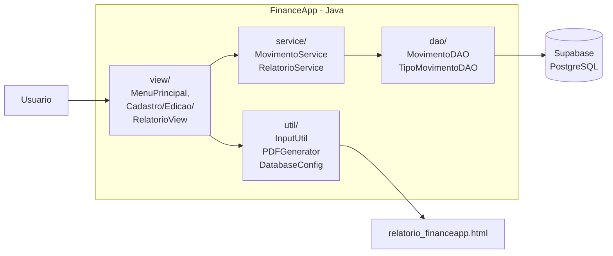
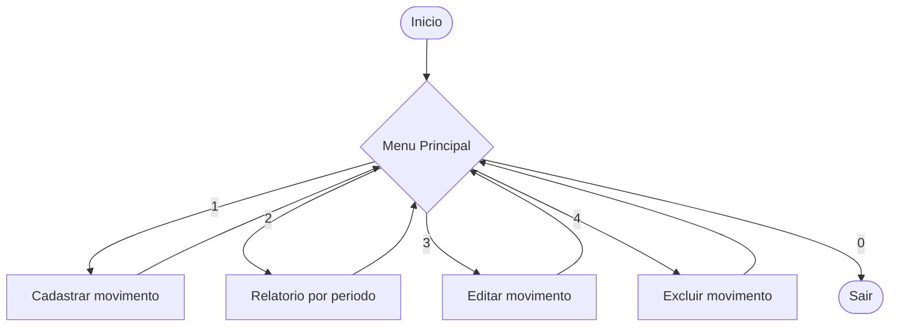
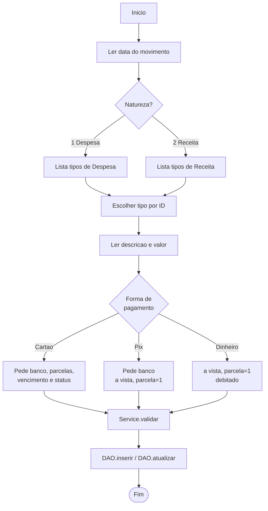
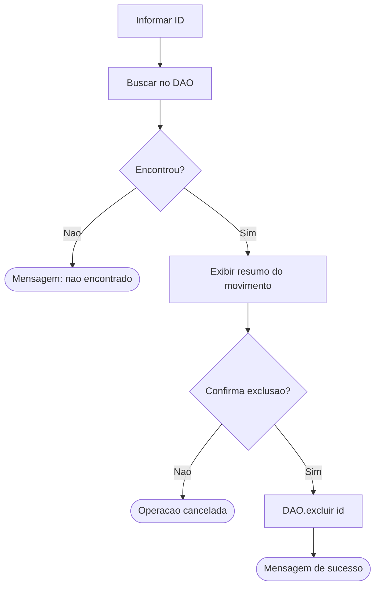

# FinanceApp

Aplicativo desktop console (Java) para controle pessoal de **despesas e receitas**.
Banco de dados: **PostgreSQL** hospedado no **Supabase**.
Trabalho desenvolvido para a disciplina (AV2).

## Requisitos atendidos

| Requisito do enunciado | Onde esta no codigo |
|---|---|
| Lancamento com data, tipo, descricao, valor, forma de pagamento, parcelas, vencimento e status (debitado?) | `model/Movimento.java` + `sql/script.sql` |
| Tipos de movimento em outra tabela | `tipo_movimento` (`sql/script.sql`) + `model/TipoMovimento.java` |
| Formas de pagamento: dinheiro, cartao, pix (com banco para cartao/pix) | `model/enums/FormaPagamentoEnum.java` + `model/FormaPagamento.java` |
| CRUD completo (cadastrar, editar, excluir, listar) | `view/CadastroMovimentoView.java`, `view/EdicaoMovimentoView.java`, `service/MovimentoService.java`, `dao/MovimentoDAO.java` |
| Relatorio em tela e PDF por periodo | `view/RelatorioView.java` + `util/PDFGenerator.java` |
| **Expressao lambda** | `service/RelatorioService.java` (filtros e somas com Stream) |
| **Enum** | `FormaPagamentoEnum`, `StatusDebito` |
| **ArrayList** | `dao/MovimentoDAO.java`, `dao/TipoMovimentoDAO.java` |
| **Value Object** | `dto/PeriodoRelatorioVO.java` (imutavel, com equals/hashCode) |

## Arquitetura e fluxo

### Camadas



### Fluxo do menu principal



### Fluxo de cadastro/edicao de movimento



### Fluxo de exclusao



## Estrutura de pastas

```
financeApp/
├── lib/                       <- coloque aqui o postgresql-XX.X.X.jar
├── sql/
│   ├── script.sql             <- schema (rode no SQL Editor do Supabase)
│   └── migrations/            <- scripts incrementais para bancos ja criados
├── src/
│   ├── app/Main.java          <- ponto de entrada
│   ├── dao/                   <- acesso a dados (JDBC + PostgreSQL)
│   ├── dto/                   <- Value Objects (PeriodoRelatorioVO)
│   ├── model/                 <- entidades de dominio
│   │   └── enums/             <- FormaPagamentoEnum, StatusDebito
│   ├── service/               <- regras de negocio + lambdas
│   ├── util/                  <- DatabaseConfig, InputUtil, PDFGenerator
│   └── view/                  <- camada de apresentacao (console)
└── README.md
```

## 1. Criar o banco no Supabase

1. Acesse [https://supabase.com](https://supabase.com) e faca login.
2. Crie um novo projeto (anote a **senha do banco** definida nesta etapa).
3. Aguarde o provisionamento do banco.
4. Va em **SQL Editor > New query**, cole o conteudo de `sql/script.sql` e
   clique em **Run**. Isso cria as tabelas `tipo_movimento` e `movimento` e ja
   popula os tipos iniciais.

> **Banco ja existente?** Se voce criou o banco em uma versao anterior do
> projeto, rode tambem o script `sql/migrations/001_outros_split.sql` para
> separar o tipo "Outros" em "Outras Despesas" e "Outras Receitas".

### Pegar a string de conexao JDBC

1. No painel do projeto, abra **Project Settings > Database**.
2. Role ate **Connection string** e selecione a aba **JDBC**.
3. **Importante:** prefira o modo **Session pooler** (porta `5432`) ou
   **Transaction pooler** (porta `6543`). Esses modos funcionam de qualquer rede
   (inclusive sem IPv6) e sao os recomendados pelo Supabase.

A string sera algo parecido com:

```
jdbc:postgresql://aws-0-sa-east-1.pooler.supabase.com:5432/postgres?user=postgres.abcdefghijk&password=SUA_SENHA&sslmode=require
```

### Atualizar `DatabaseConfig.java`

Edite `src/util/DatabaseConfig.java` e troque os valores:

```java
public static final String HOST     = "aws-0-sa-east-1.pooler.supabase.com";
public static final int    PORTA    = 5432;
public static final String DATABASE = "postgres";
public static final String USUARIO  = "postgres.abcdefghijk"; // copie do painel
public static final String SENHA    = "SUA_SENHA";
```

> Em caso de duvida, copie literalmente o que aparece em "Connection string"
> do Supabase. O parametro `sslmode=require` ja esta na URL montada.

## 2. Driver JDBC do PostgreSQL

Baixe o driver oficial em:
[https://jdbc.postgresql.org/download/](https://jdbc.postgresql.org/download/)

Copie o arquivo (ex.: `postgresql-42.7.4.jar`) para a pasta `lib/`.

## 3. Compilar e executar pelo terminal (Windows)

Atalho via PowerShell (recomendado):

```powershell
.\build.ps1     # compila para a pasta bin/
.\run.ps1       # executa app.Main
```

Ou manualmente via cmd:

```cmd
mkdir bin
javac -d bin -cp "lib/*" src/app/*.java src/dao/*.java src/dto/*.java src/model/*.java src/model/enums/*.java src/service/*.java src/util/*.java src/view/*.java
java -cp "bin;lib/*" app.Main
```

## 4. Executar no Eclipse / IntelliJ / VS Code

1. Marque a pasta `src` como **Source Folder**.
2. Adicione o `postgresql-XX.X.X.jar` ao **Build Path / classpath**.
3. Execute a classe `app.Main`.

## Como usar

Ao iniciar a aplicacao o seguinte menu e exibido:

```
1 - Cadastrar movimento
2 - Relatorio por periodo
3 - Editar movimento
4 - Excluir movimento
0 - Sair
```

1. **Cadastrar movimento** - primeiro escolha a **natureza** (1 - Despesa,
   2 - Receita). Em seguida o sistema lista apenas os tipos daquela natureza.
   Para `Cartao` ou `Pix` o sistema pede o nome do banco. Para `Cartao` tambem
   pergunta parcelas, vencimento e se ja foi debitado.
2. **Relatorio por periodo** - informe data inicial e final. O resultado aparece
   no console e voce pode gerar um arquivo HTML com layout de impressao
   (`relatorio_financeapp.html`) que abre no navegador. Use
   `Imprimir > Salvar como PDF` para gerar o PDF final.
3. **Editar movimento** - informe o ID, confirme o registro exibido e
   reinforme os campos. As mesmas validacoes do cadastro sao aplicadas.
4. **Excluir movimento** - informe o ID, confirme o registro exibido e o
   sistema remove o lancamento do banco.

> Dica: o ID de cada movimento aparece na primeira coluna do relatorio.

## Onde estao os elementos exigidos

- **Lambda**: `RelatorioService.totalDespesas/totalReceitas/totalPendentes`
  (`stream().filter(m -> ...)`).
- **Enum**: `FormaPagamentoEnum` (com atributos `descricao` e `exigeBanco`)
  e `StatusDebito`.
- **ArrayList**: instanciado em `MovimentoDAO.buscarPorPeriodo` e
  `TipoMovimentoDAO.listarTodos`.
- **Value Object**: `PeriodoRelatorioVO` - classe `final`, atributos `final`,
  validacao no construtor, `equals/hashCode` por valor.

## Solucao de problemas

| Sintoma | Provavel causa / solucao |
|---|---|
| `Driver JDBC do PostgreSQL nao encontrado` | Falta o jar do driver na pasta `lib/`. |
| `password authentication failed for user "postgres"` | Use o usuario do pooler (`postgres.SEU_PROJECT_REF`) e a senha definida na criacao do projeto. |
| `Connection refused` ou demora para conectar | Use o pooler do Supabase (porta 5432 ou 6543) em vez do host direto. |
| `SSL required` | Confira se o `sslmode=require` esta na URL (ja esta no `DatabaseConfig`). |
