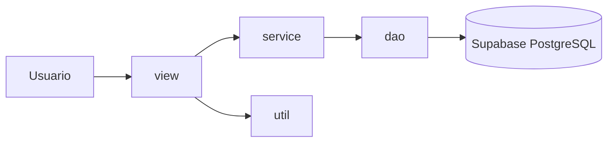
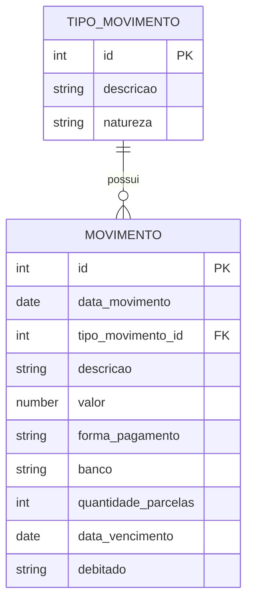
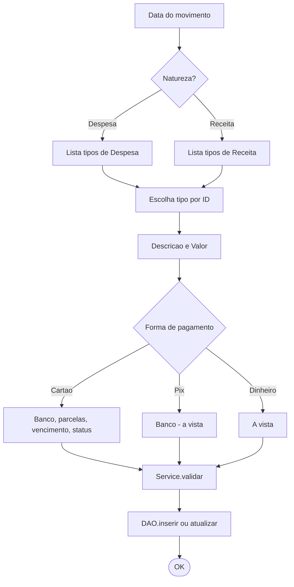
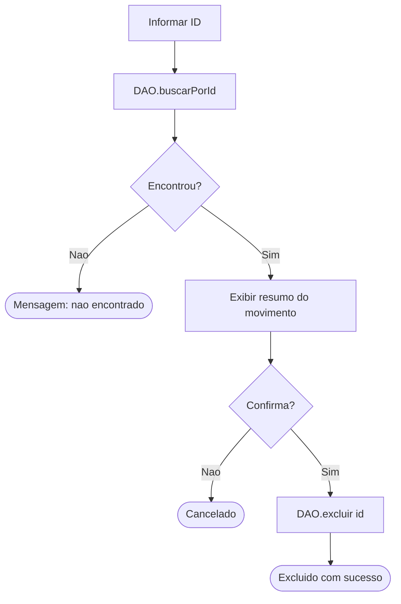

<!-- _class: lead -->
<!-- _paginate: false -->

# FinanceApp
## Controle pessoal de despesas e receitas

Aplicativo console em **Java + PostgreSQL/Supabase**

Trabalho AV2

---

## Agenda

1. Objetivo do projeto
2. Funcionalidades
3. Arquitetura em camadas
4. Modelo de dados
5. Tecnologias utilizadas
6. Requisitos do trabalho atendidos
7. Fluxo de uso (demo)
8. Tratamento de erros e validacoes
9. Proximos passos
10. Perguntas

---

## 1. Objetivo

Permitir que o usuario controle seus lancamentos financeiros pelo terminal:

- Cadastrar **despesas** e **receitas**
- Editar e excluir lancamentos
- Consultar **relatorios por periodo**
- Gerar **relatorio em PDF** (via HTML imprimivel)
- Persistir tudo em **PostgreSQL** hospedado no **Supabase**

> Foco: simplicidade, didatica e atender aos requisitos da disciplina (lambda, enum, ArrayList, Value Object).

---

## 2. Funcionalidades

| Opcao | Descricao |
|-------|-----------|
| 1 | Cadastrar movimento (escolha de natureza + tipo) |
| 2 | Relatorio por periodo (console + HTML/PDF) |
| 3 | Editar movimento (por ID) |
| 4 | Excluir movimento (por ID) |
| 0 | Sair |

Formas de pagamento suportadas: **Dinheiro**, **Cartao** (com banco e parcelamento), **Pix** (com banco, a vista).

---

## 3. Arquitetura em camadas



- **view**: interacao com o console (`MenuPrincipal`, `Cadastro/Edicao/Relatorio`)
- **service**: regras de negocio e validacoes (`MovimentoService`, `RelatorioService`)
- **dao**: acesso a banco via JDBC (`MovimentoDAO`, `TipoMovimentoDAO`)
- **util**: utilitarios (`InputUtil`, `PDFGenerator`, `DatabaseConfig`)

---

## 4. Modelo de dados



Tipos cadastrados pre-populados: Salario, Freelance, Plano de Saude, Energia Eletrica, Outras Despesas, Outras Receitas, etc.

---

## 5. Tecnologias

- **Java 21** (compativel com 17+)
- **JDBC** com driver `postgresql-42.7.4.jar`
- **PostgreSQL** hospedado no **Supabase**
- **PowerShell scripts** para build e execucao (`build.ps1` / `run.ps1`)
- **Markdown + Mermaid** para documentacao com diagramas

Sem frameworks externos: o objetivo e mostrar dominio dos fundamentos.

---

## 6. Requisitos do trabalho

| Requisito | Onde aparece |
|-----------|--------------|
| Lambda | `RelatorioService` (Stream + filter/reduce/count) |
| Enum   | `FormaPagamentoEnum`, `StatusDebito` |
| ArrayList | `MovimentoDAO.buscarPorPeriodo`, `TipoMovimentoDAO.listarTodos` |
| Value Object | `PeriodoRelatorioVO` (final, atributos final, equals/hashCode) |
| Tabela de tipos separada | `tipo_movimento` |
| Forma pagamento (Dinheiro/Cartao/Pix) com banco | `FormaPagamento` + enum |
| Data, descricao, valor, parcelas, vencimento, status | `Movimento` + tabela |
| Relatorio por periodo (tela + PDF) | `RelatorioView` + `PDFGenerator` |

---

## 6.1 Exemplo de lambda

```java
public BigDecimal totalDespesas(List<Movimento> movimentos) {
    return movimentos.stream()
            .filter(m -> m.getTipoMovimento().isDespesa()) // <- LAMBDA
            .map(Movimento::getValor)
            .reduce(BigDecimal.ZERO, BigDecimal::add);
}

public long totalPendentes(List<Movimento> movimentos) {
    return movimentos.stream()
            .filter(m -> !m.isDebitado()) // <- LAMBDA
            .count();
}
```

Filtro, mapeamento e reducao via Stream API, sem `for` manual.

---

## 6.2 Exemplo de enum com comportamento

```java
public enum FormaPagamentoEnum {
    DINHEIRO("Dinheiro", false, false),
    CARTAO  ("Cartao",   true,  true),
    PIX     ("Pix",      true,  false);

    private final String  descricao;
    private final boolean exigeBanco;
    private final boolean permiteParcelamento;
    // ... getters
}
```

Cada constante carrega seu proprio comportamento (banco obrigatorio, parcelamento permitido), evitando `if`/`switch` espalhados.

---

## 7. Fluxo de cadastro/edicao



---

## 7.1 Fluxo de exclusao



Confirmacao explicita evita exclusoes acidentais.

---

## 8. Tratamento de erros e validacoes

- **Validacao no service** antes de chamar o DAO:
  - Valor > 0, descricao obrigatoria, banco obrigatorio para Cartao/Pix, etc.
- **Mensagens claras no console**:
  ```
  >> Erro de validacao: Valor deve ser maior que zero.
  >> Erro de banco de dados: connection refused.
  ```
- **InputUtil** repete a pergunta enquanto o tipo for invalido (data, decimal, inteiro).
- Operacoes de **edicao e exclusao** mostram resumo + pedem confirmacao antes de aplicar.

---

## 9. Demo - Cadastro

```text
====== Cadastro de Movimento ======
Data do movimento (dd/MM/yyyy): 25/05/2026

Natureza do movimento:
  1 - Despesa
  2 - Receita
Escolha: 1

Tipos de Despesa:
  3 - Energia Eletrica (Despesa)
  7 - Internet (Despesa)
  ...
Informe o ID do tipo: 7
Descricao: Plano fibra
Valor (R$): 99.90
Formas de pagamento: 1-Dinheiro 2-Cartao 3-Pix
...
>> Movimento cadastrado com sucesso! ID = 42
```

---

## 9.1 Demo - Relatorio por periodo

```text
====== Relatorio de Movimentos ======
Data inicial (dd/MM/yyyy): 01/05/2026
Data final   (dd/MM/yyyy): 31/05/2026

ID  Data       Tipo                Descricao        Valor   Forma         ...
42  25/05/2026 Internet            Plano fibra      99.90   Cartao (Itau) ...
...

Total de Receitas: R$ 4500.00
Total de Despesas: R$ 1320.40
Saldo do periodo:  R$ 3179.60
Lancamentos pendentes (nao debitados): 2

Deseja gerar o relatorio em PDF? (S/N): S
>> Relatorio gerado em: relatorio_financeapp.html
```

---

## 10. Proximos passos (futuras melhorias)

- Filtros adicionais no relatorio (por tipo, por forma de pagamento).
- Importacao/exportacao em CSV.
- Interface grafica (Swing ou JavaFX).
- Multiusuario com autenticacao.
- Categorizacao automatica via regras.

---

<!-- _class: lead -->

# Obrigado!

Repositorio: `financeApp/`
Documentacao completa: `README.md`
Migracoes SQL: `sql/migrations/`

**Perguntas?**
