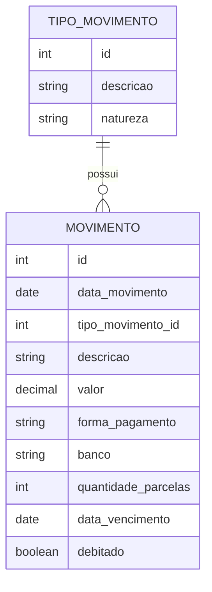

# `sql/` - Scripts de banco de dados

Scripts SQL para criar e atualizar o schema no Supabase/PostgreSQL.

## Arquivos

| Arquivo | Quando usar |
|---------|-------------|
| `script.sql` | Criacao **do zero** das tabelas (rodar uma unica vez ao criar o banco) |
| `migrations/001_outros_split.sql` | Atualizacao incremental para bancos ja criados antes do split de "Outros" |

## `script.sql`

Cria duas tabelas:

Detalhes importantes:

- `valor` e `NUMERIC(12,2)` - precisao monetaria (nada de FLOAT).
- `tipo_movimento_id` tem FK para `tipo_movimento(id)`.
- Indices em `data_movimento` e `data_vencimento` (relatorio por periodo).
- Constraint `UNIQUE` em `tipo_movimento.descricao`.
- Carga inicial de tipos: Plano de Saude, Salao, Energia, Salario, etc.

## `migrations/`

Scripts incrementais para alterar bancos existentes sem perder dados.

### `001_outros_split.sql`

Renomeia o tipo `"Outros"` para `"Outras Despesas"` e cria
`"Outras Receitas"`. Necessario porque a UI passou a separar as listas
por natureza (Despesa/Receita).

Idempotente: pode ser executado mais de uma vez sem erro.

## Como executar no Supabase

1. Abra o painel do projeto Supabase.
2. Va em **SQL Editor &gt; New query**.
3. Cole o conteudo do arquivo desejado.
4. Clique em **Run**.

## Tags

#projeto/banco #sql #postgresql #supabase
