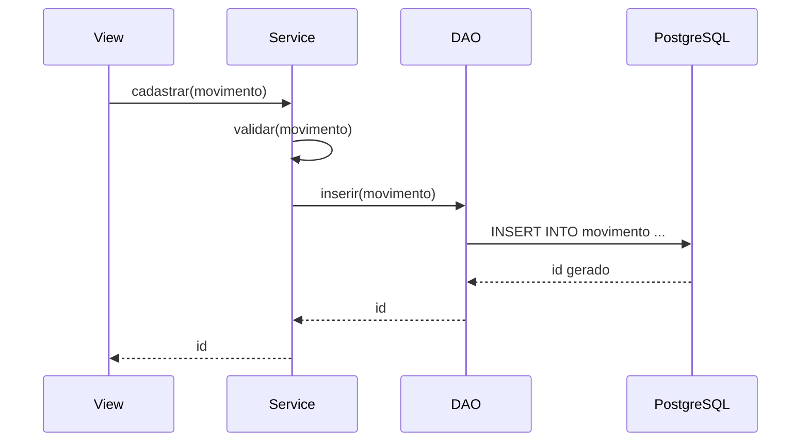

# `dao/` - Acesso ao banco (JDBC)

Camada que conhece SQL e fala diretamente com o PostgreSQL via driver JDBC.

## Arquivos

| Arquivo | Responsabilidade |
|---------|-------------------|
| `ConnectionFactory.java` | Fabrica unica de `Connection` JDBC |
| `MovimentoDAO.java` | CRUD da tabela `movimento` + busca por periodo |
| `TipoMovimentoDAO.java` | Listagem e busca de `tipo_movimento` |

## `ConnectionFactory`

- Bloco `static` carrega o driver via `Class.forName`.
- Construtor privado + `final`: classe utilitaria, sem instancias.
- `getConnection()` abre uma nova conexao usando [[../util/utilitarios|DatabaseConfig]].
- Reembala `SQLException` com URL/usuario para diagnostico.

## `MovimentoDAO`

Operacoes:
- `inserir(Movimento m)` - retorna o ID gerado.
- `atualizar(Movimento m)` - retorna `boolean` (afetou linha).
- `excluir(int id)` - retorna `boolean`.
- `buscarPorId(int id)` - traz o movimento com seu `TipoMovimento`.
- `buscarPorPeriodo(PeriodoRelatorioVO)` - lista para relatorio.

SQLs principais:
```sql
INSERT INTO movimento (...) VALUES (?, ?, ...)
UPDATE movimento SET ... WHERE id = ?
DELETE FROM movimento WHERE id = ?
SELECT m.*, t.* FROM movimento m JOIN tipo_movimento t ON ...
```

## `TipoMovimentoDAO`

Operacoes:
- `listarTodos()` - usado para popular as listas do menu.
- `buscarPorId(int id)` - usado pelo service.
- `inserir(TipoMovimento)` - opcional, nao utilizado no app atualmente.

## Convencoes

- **PreparedStatement** sempre. Nada de concatenar strings em SQL.
- **try-with-resources** em todos os blocos de banco.
- **ArrayList** como tipo concreto das listas (requisito do trabalho).
- DAO so cuida de SQL/JDBC. Validacoes ficam em [[../service/regras-negocio|service]].

## Diagrama: chamada do DAO



## Tags

#projeto/codigo #java/dao #jdbc #postgresql
