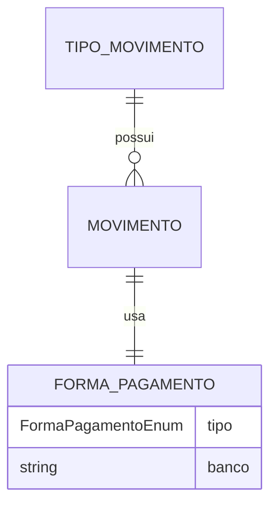

# `model/` - Entidades de dominio

Classes que representam os conceitos do mundo real do FinanceApp.

## Arquivos

| Arquivo | Representa |
|---------|------------|
| `Movimento.java` | Um lancamento financeiro (despesa ou receita) |
| `TipoMovimento.java` | Categoria do movimento (ex.: Energia, Salario) |
| `FormaPagamento.java` | Forma de pagamento + banco (quando aplicavel) |

E uma subpasta:

- [[enums/enumeracoes|enums/]] - `FormaPagamentoEnum`, `StatusDebito`

## `Movimento`

Atributos:
- `id` (int)
- `dataMovimento` (LocalDate)
- `tipoMovimento` (TipoMovimento) - referencia para `tipo_movimento`
- `descricao` (String)
- `valor` (BigDecimal) - precisao monetaria
- `formaPagamento` (FormaPagamento)
- `quantidadeParcelas` (int)
- `dataVencimento` (LocalDate)
- `status` (StatusDebito) - DEBITADO ou PENDENTE

Metodo de conveniencia: `isDebitado()` que delega para o enum `StatusDebito`.

## `TipoMovimento`

- `id`, `descricao`, `natureza` (`'D'` ou `'R'`).
- `isDespesa()` retorna `true` se a natureza e despesa.
- `toString()` retorna `id - descricao (Despesa/Receita)`.

## `FormaPagamento`

- Combina o enum [[enums/enumeracoes|FormaPagamentoEnum]] com o nome do banco.
- `isValido()` valida que o banco esta preenchido quando o tipo exige (Cartao/Pix).
- `toString()` formata como `"Cartao (Itau)"`.

## Diagrama de relacionamento

## Tags

#projeto/codigo #java/model #dominio
