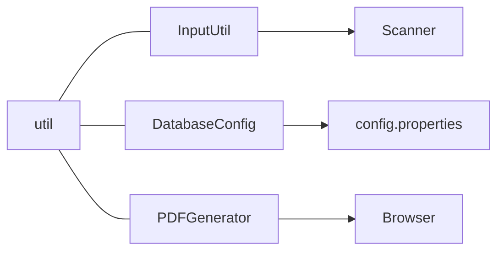

# `util/` - Utilitarios

Classes de apoio que nao se encaixam em camadas especificas.

## Arquivos

| Arquivo | Responsabilidade |
|---------|-------------------|
| `InputUtil.java` | Leitura segura do console (texto, numero, data, sim/nao) |
| `DatabaseConfig.java` | Carrega credenciais do `config.properties` e monta a URL JDBC |
| `PDFGenerator.java` | Gera relatorio em HTML com layout de impressao (PDF via navegador) |

## `InputUtil`

Wrapper sobre `Scanner(System.in)`. Metodos:

- `lerTexto(prompt)` - texto obrigatorio.
- `lerTextoOpcional(prompt)` - aceita vazio.
- `lerInteiro(prompt)` - repete ate ser um inteiro valido.
- `lerDecimal(prompt)` - aceita virgula ou ponto.
- `lerData(prompt)` - exige `dd/MM/yyyy`.
- `lerSimNao(prompt)` - aceita `S/N` ou `Sim/Nao`.

Cada metodo repete a pergunta enquanto o usuario nao informar um valor
do tipo correto, evitando crashes por entrada invalida.

## `DatabaseConfig`

- Carrega `config.properties` (do classpath ou diretorio atual).
- Constantes publicas:
  - `DRIVER` (`org.postgresql.Driver`)
  - `HOST`, `PORTA`, `DATABASE`, `USUARIO`, `SENHA`
  - `URL` ja montada com `sslmode=require`
- Falha rapido se uma propriedade obrigatoria estiver ausente.

> Veja [[../../config.properties.example]] para template das credenciais.

## `PDFGenerator`

- Recebe periodo, lista de movimentos e totais.
- Monta um arquivo `relatorio_financeapp.html` na pasta de execucao.
- Tenta abrir no navegador via `Desktop.browse(...)`.
- O HTML tem `media="print"` e `window.print()` automatico.
- Usuario salva como PDF pela caixa de impressao do navegador.

Vantagem: zero dependencias externas (sem iText, sem PDFBox).

## Diagrama: dependencias do `util`

## Tags

#projeto/codigo #java/util
