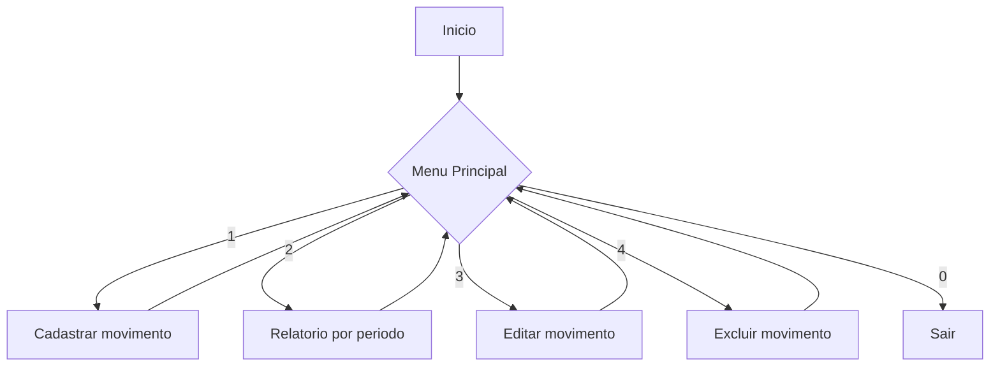

# `view/` - Camada de apresentacao (console)

Telas em modo texto que interagem diretamente com o usuario.

## Arquivos

| Arquivo | Responsabilidade |
|---------|-------------------|
| `MenuPrincipal.java` | Menu principal com as 4 opcoes + Sair |
| `CadastroMovimentoView.java` | Cadastro de novo movimento + leitura reutilizavel para edicao |
| `EdicaoMovimentoView.java` | Edicao e exclusao de movimento por ID |
| `RelatorioView.java` | Relatorio por periodo no console e geracao do HTML/PDF |

## Fluxo do menu

## Detalhes

### `CadastroMovimentoView`
- Pergunta data do movimento.
- Pergunta natureza (Despesa ou Receita) e filtra a lista de tipos.
- Le descricao, valor e forma de pagamento.
- Para Cartao: pergunta banco, parcelas, vencimento, status.
- Para Pix: pergunta banco, define a vista.
- Para Dinheiro: define a vista.
- Chama [[../service/regras-negocio|MovimentoService]].cadastrar.
- Metodo `lerDadosMovimento` e reusado por `EdicaoMovimentoView`.

### `EdicaoMovimentoView`
- Pede ID, busca o movimento, exibe resumo, confirma e atualiza/exclui.
- Reaproveita a mesma logica de leitura do `CadastroMovimentoView`.

### `RelatorioView`
- Pede periodo (datas).
- Mostra tabela formatada no console.
- Calcula totais via [[../service/regras-negocio|RelatorioService]].
- Pergunta se gera o HTML/PDF via [[../util/utilitarios|PDFGenerator]].

## Boas praticas usadas

- Toda entrada via [[../util/utilitarios|InputUtil]] para validar tipo do dado.
- Excecoes (`SQLException`, `IllegalArgumentException`) sao capturadas e
  apresentadas com mensagens amigaveis prefixadas com `>>`.
- Nenhuma view conhece o banco de dados.

## Tags

#projeto/codigo #java/view #console
