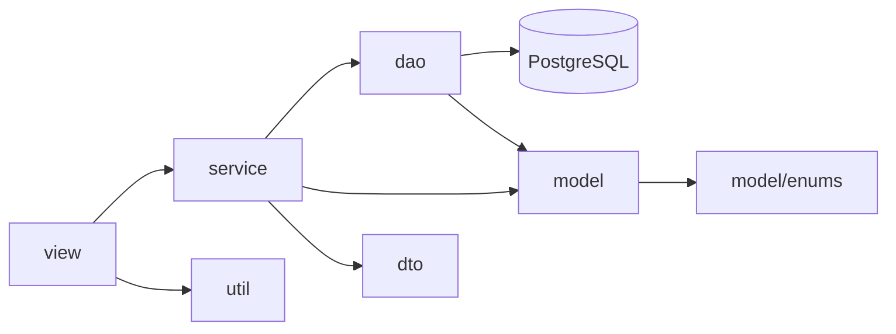

# `src/` - Codigo fonte

Pasta principal com todo o codigo Java do FinanceApp, organizado por camadas.

## Organizacao em camadas

## Subpastas

| Pasta | Responsabilidade |
|-------|------------------|
| [[app/main\|app]] | Ponto de entrada (`Main.java`) |
| [[view/telas-console\|view]] | Interface com o usuario via console |
| [[service/regras-negocio\|service]] | Regras de negocio, validacoes, lambdas |
| [[dao/acesso-banco\|dao]] | Acesso ao banco de dados via JDBC |
| [[model/entidades\|model]] | Entidades de dominio (`Movimento`, `TipoMovimento`, `FormaPagamento`) |
| [[model/enums/enumeracoes\|model/enums]] | Enums (`FormaPagamentoEnum`, `StatusDebito`) |
| [[dto/value-objects\|dto]] | Value Objects (`PeriodoRelatorioVO`) |
| [[util/utilitarios\|util]] | Utilitarios (input, PDF, config de banco) |

## Convencoes do projeto

- **Java 21** (compativel com 17+)
- Sem frameworks externos. So `JDBC` e biblioteca padrao.
- `try-with-resources` para todo recurso de banco.
- `PreparedStatement` em todo SQL (anti SQL Injection).
- `BigDecimal` para valores monetarios.
- `LocalDate` para datas.

## Tags

#projeto/codigo #java
